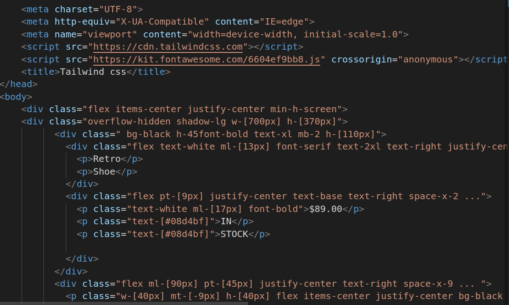
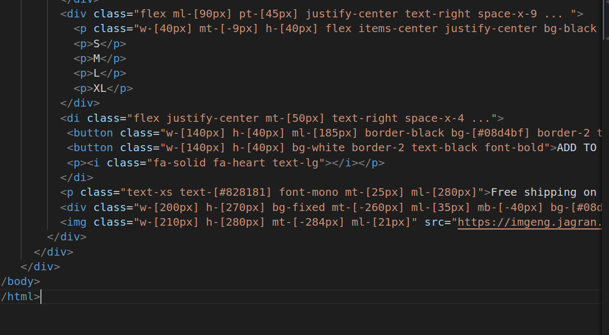

# Tailwind project

# Hosted Link
https://nikhitha5511.github.io/Tailwindcss1/

1.

2.

* div class="flex items-center justify-center min-h-screen": This div is a container that uses Tailwind CSS classes to center its content both vertically (items-center) and horizontally (justify-center) on the screen. It also ensures a minimum height of the screen (min-h-screen).
* div class="overflow-hidden shadow-lg w-[700px] h-[370px]": This div represents the card container. It has the following characteristics:
* overflow-hidden: This class hides any content that overflows the container.
shadow-lg: Adds a shadow to the container, creating a subtle depth effect.
* w-[700px]: Sets the width of the container to 700 pixels.
* h-[370px]: Sets the height of the container to 370 pixels.
* div class="bg-black h-45 font-bold text-xl mb-2 h-[110px]": This div is the header section of the card. It has a black background color and the following styles:
* h-45: Sets the height to 45 pixels.
font-bold: Applies bold text.
text-xl: Sets the text size to extra-large.
mb-2: Adds a margin at the bottom.
* h-[110px]: Sets the height to 110 pixels.
* div class="flex text-white ml-[13px] font-serif text-2xl text-right justify-center space-x-4 ... font-bold pt-[25px]": This div contains the title and price section within the header. It uses several Tailwind CSS classes to style the content, including flex layout, text color, font size, spacing, and bold text.
* div class="flex pt-[9px] justify-center text-base text-right space-x-2 ...": This div contains the price and "IN STOCK" text. It also uses Tailwind CSS classes for styling, including flex layout, text alignment, spacing, and text color.
* div class="flex ml-[90px] pt-[45px] justify-center text-right space-x-9 ...": This div represents the size options section of the card. It contains size labels and uses Tailwind CSS classes for flex layout, margin, text alignment, and spacing.
* div class="flex justify-center mt-[50px] text-right space-x-4 ...": This div contains action buttons like "BUY NOW," "ADD TO BAG," and a heart icon. It uses flex layout and Tailwind CSS classes for styling, including text alignment, spacing, and button styles.
* p class="text-xs text-[#828181] font-mono mt-[25px] ml-[280px]": This p element provides shipping information. It uses Tailwind CSS classes for text size, color, font style, margin, and text alignment.
* div class="w-[200px] h-[270px] bg-fixed mt-[-260px] ml-[35px] mb-[-40px] bg-[#08d4bf]": This div is used for a background element with a fixed position. It provides a colored background effect to the bottom of the card. It uses Tailwind CSS classes to set its dimensions, position, and background color.
* img class="w-[210px] h-[280px] mt-[-284px] ml-[21px]" src="...": This img element displays the product image. It uses Tailwind CSS classes to set its dimensions and margins for positioning within the card.
* Tailwind CSS Classes:
* flex: Sets the display property to flex, allowing for flexible layout.
* items-center: Vertically centers content within a flex container.
* justify-center: Horizontally centers content within a flex container.
* min-h-screen: Sets a minimum height to fill the screen.
* overflow-hidden: Hides any content that overflows the container.
shadow-lg: Adds a shadow to create a depth effect.
* w-[700px]: Sets the width to 700 pixels.
* h-[370px]: Sets the height to 370 pixels.
* bg-black: Sets the background color to black.
* h-45: Sets the height to 45 pixels.
* font-bold: Applies bold text.
* text-xl: Sets the text size to extra-large.
* mb-2: Adds a margin at the bottom.
* h-[110px]: Sets the height to 110 pixels.
* text-white: Sets the text color to white.
* ext-white: Sets the text color to white.
* ml-[13px], ml-[17px], etc.: Adds left margin with specified values.
* text-2xl, text-base, etc.: Sets text sizes.
* text-right: Aligns text to the right.
space-x-4, space-x-2, etc.: Adds spacing between elements in the X-axis (horizontal).
* flex: Sets the display property to flex.
* pt-[25px], pt-[9px], etc.: Adds top padding with specified values.
* ml-[90px], ml-[185px], etc.: Adds left margin with specified values.
* mt-[-9px], mt-[50px], etc.: Adds top margin with specified values.
* w-[140px]: Sets the width to 140 pixels.
* h-[40px]: Sets the height to 40 pixels.
* bg-[#08d4bf]: Sets the background color to a specific color.
* border-black: Adds a black border.
* border-2: Adds a 2-pixel border.
* text-black, text-[#828181], etc.: Sets text color to specified colors.
* font-mono, font-serif, etc.: Applies specific font styles.
* bg-fixed: Sets the background as fixed.
text-xs: Sets text size to extra-small.
